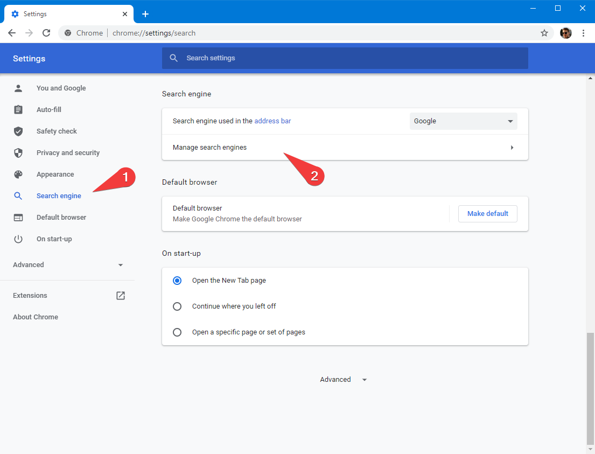
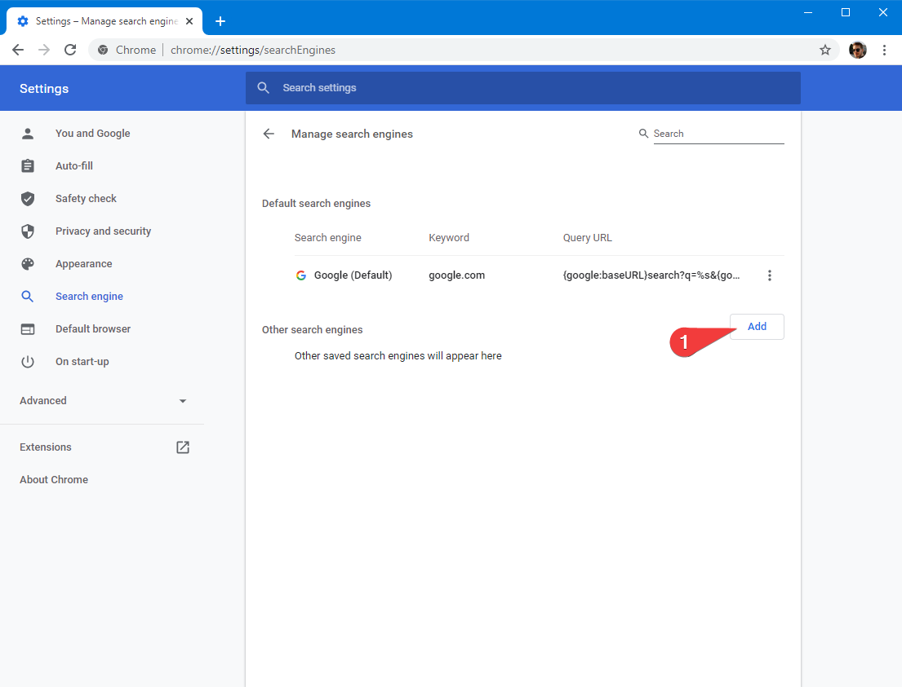
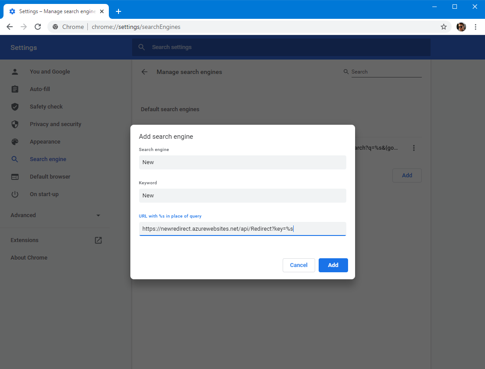

# NewRedirect

Redirects users to web pages where they can create new resources.

### Example

A GET request to
```
https://newredirect.azurewebsites.net/api/redirect?key=doc
```
Will redirect you to
```
https://docs.google.com/document/u/0/create
```
Which is the URL for a new Google doc.

### Currently Supported Redirects
(Feel free to PR-in more!)

You can visit
```
https://newredirect.azurewebsites.net/api/all
```
to see all the currently available routes, some of the key ones are:

| Key    | URL                                             |
|--------|-------------------------------------------------|
| doc    | https://docs.google.com/document/u/0/create     |
| sheet  | https://docs.google.com/spreadsheets/u/0/create |
| slides | https://docs.google.com/presentation/u/0/create |
| form   | https://docs.google.com/forms/u/0/create        |

### Why? (Browser Search Engine)

This tool is only really useful when it is set up as a secondary search engine in your web browser.

Most browsers allow you to set up custom search engines which they will use when your search is prefixed with a specific term.  
You can set this Azure Function up as a search engine by setting up the URL parameter `key` to be the location for the search term.

This functionality allows you to configure your browser so that typing
```
new doc
```
opens up a new Google Doc, for example.

#### Chrome




That URL is: `https://newredirect.azurewebsites.net/api/redirect?key=%s`. The `%s` will be replaced by the search term, which could be `doc` or `sheet` etc.
